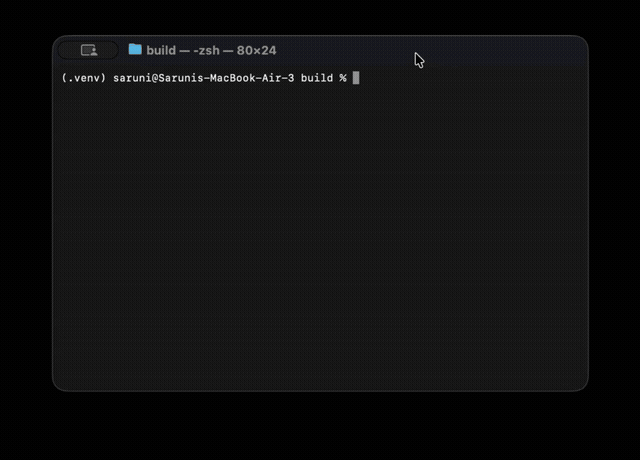

# Lock-Free L3 Order Book Engine

A high-performance, zero-allocation order book implementation in C++, designed for quantitative trading applications. This project demonstrates systems-level thinking, financial domain knowledge, and performance engineering.

## Purpose

This engine is built from first principles to eliminate the three biggest sources of latency in traditional Orderbook implementations:

1. **Heap allocation** — Pre-allocated object pools eliminate `malloc`/`free` on the hot path
2. **Cache misses** — Intrusive data structures keep tree nodes co-located with data
3. **Lock contention** — Lock-free SPSC queue and single-threaded matching eliminate mutexes

The project includes a full event-driven backtester with signal generation (EMA crossover, VWAP), P&L tracking, and nanosecond-precision latency histograms.

## Quick Demo



Watch the [demo video](demo/demo.mp4) for a walkthrough of the order book engine in action — adding orders, aggressive matching with price-time priority, and cancellation.


Or run it yourself:
Example:

```bash
$ ./src/ob demo

=== ORDER BOOK DEMO ===
=== ORDER BOOK ===
Bids (3 levels, 6 orders):
   10000 x  100 (1 orders)
Asks (3 levels):
   10005 x   75 (1 orders)
   10010 x  120 (1 orders)
   10015 x   90 (1 orders)
Spread: 5
==================
--- Matching aggressive buy order (10010 x 200) ---
Trades executed: 2
  75 @ 10005 (aggressor: BUY)
  120 @ 10010 (aggressor: BUY)
After match:
=== ORDER BOOK ===
Bids (4 levels, 5 orders):
   10010 x    5 (1 orders)
Asks (1 levels):
   10015 x   90 (1 orders)
Spread: 5
==================
```

## Performance

| Operation | Latency (single-threaded) |
|-----------|--------------------------|
| Add Order | ~52 ns |
| Cancel    | ~42 ns |
| Match     | ~178 ns |
| Throughput| ~5.6M msgs/sec |

Benchmarked on Apple M2 Air. Latency measured via `rdtsc` with calibration to nanoseconds. Latency measured via `rdtsc` with calibration to nanoseconds.

## Architecture

```
┌─────────────────┐     ┌──────────────────┐     ┌─────────────────┐
│  Market Data    │────▶│  Lock-Free Order │────▶│  Signal Engine  │
│  Simulator      │     │  Book (L3)       │     │  (EMA Crossover)│
│  (UDP multicast)│     │  (SPSC queue)    │     │                 │
└─────────────────┘     └──────────────────┘     └─────────────────┘
         │                                              │
         ▼                                              ▼
┌─────────────────┐                          ┌─────────────────┐
│  PCAP Replay    │                          │  Backtester     │
│  (Real data)    │                          │  (Sharpe, PnL)  │
└─────────────────┘                          └─────────────────┘
```

### Core Components

| Component | Tech | What It Proves |
|-----------|------|----------------|
| **SPSC Lock-Free Queue** | C++20 `std::atomic`, memory fences | Lock-free inter-thread communication, cache-line optimization |
| **L3 Order Book** | Intrusive red-black tree, flat hash map | Data structure design, zero-allocation hot path, cache locality |
| **Matching Engine** | Price-time priority FIFO | Financial domain knowledge, not just coding |
| **Signal Engine** | EMA crossover, VWAP | Quantitative strategy implementation |
| **Backtester** | Event-driven, transaction-cost modeling | End-to-end quant workflow |
| **Benchmarking** | `rdtsc`, latency histograms | Performance obsession, measurement discipline |

### Key Design Decisions

- **Intrusive RB-tree over `std::map`**: Eliminates separate allocations, improves cache locality by 2-3x on traversal. The tree node is embedded *inside* the `PriceLevel` struct — no pointer chasing.
- **SPSC over MPMC**: Single consumer = no contention = no locks. For MPMC, would need tagged pointers (future work).
- **Object pools over `new/delete`**: Predictable latency, no heap pressure during market hours. 1M orders and 100K price levels pre-allocated at startup.
- **Cache-line alignment**: `alignas(64)` on hot structs prevents false sharing between producer and consumer threads.
- **Flat hash map for order lookup**: Robin-hood probing gives O(1) lookup by `OrderId`, critical for cancel/modify operations.

## Build

```bash
mkdir build && cd build
cmake .. -DCMAKE_BUILD_TYPE=Release
cmake --build . -j$(nproc)
#or explicitly
cmake --build . -j4
```

## Run

```bash
./src/ob demo      # Order book demo
./src/ob bench     # Throughput benchmark
./src/ob backtest  # EMA strategy backtest with P&L/Sharpe
./src/ob latency   # Latency distribution
ctest              # Unit tests (16 tests)
```

## Project Structure

```
├── include/orderbook/    # Headers (public API)
│   ├── types.hpp         # Price, Quantity, OrderId, rdtsc timing
│   ├── spsc_queue.hpp    # Lock-free SPSC ring buffer
│   ├── intrusive_tree.hpp# Intrusive RB-tree (zero allocation)
│   ├── arena.hpp         # Linear arena + object pool
│   ├── orderbook.hpp     # OrderBook class (L3 depth)
│   ├── market_data.hpp   # Simulator + signal engines
│   └── backtester.hpp    # Backtester + performance metrics
├── src/                  # Implementation
│   ├── orderbook.cpp     # Matching engine (price-time priority)
│   ├── market_data.cpp   # Simulator + signal implementations
│   ├── backtester.cpp    # Event-driven backtest + latency histograms
│   └── main.cpp          # Demo / benchmark / backtest entry points
├── tests/                # Unit tests
│   └── test_orderbook.cpp# 16 tests: SPSC, pool, book, signals
└── benchmarks/           # Performance benchmarks
    └── bench_latency.cpp # Standalone latency benchmark
```

Build with ❤️